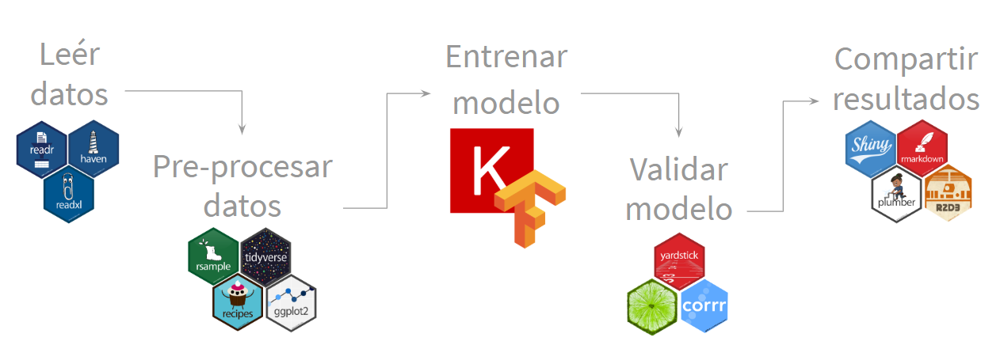
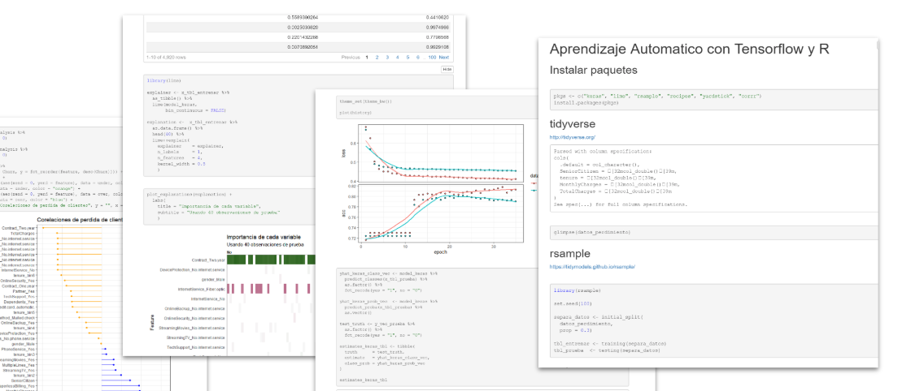
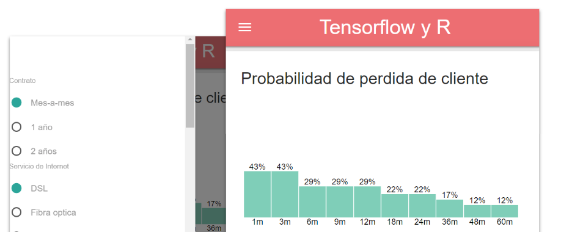
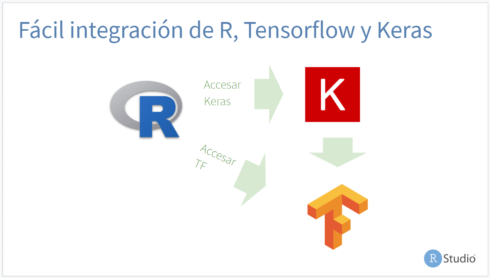

Tensorflow y R
======================================================

## Contenidos

### Ejercicio dentro de un R Notebook

- La versión publicada, y que contiene los resultados del código: https://colorado.rstudio.com/rsc/content/2246/tensorflow-y-r.nb.html
- El R Notebook está en el folder `Rmd`: https://github.com/edgararuiz/datadaymx/blob/master/Rmd/tensorflow-y-r.Rmd

### Aplicación Shiny

- Una aplicación que accede el modelo de Tensorflow directamente está disponible aquí: https://colorado.rstudio.com/rsc/content/2245/ 
- El link corto: [rstd.io/clientes](https://rstd.io/clientes)
- El código y todos los archivos en que depende están en el folder llamado `Aplicación`: https://github.com/edgararuiz/datadaymx/tree/master/aplicacion

### Presentación

La versión PDF está aquí: https://github.com/edgararuiz/datadaymx/blob/master/presentacion/tensorflow-y-R.pdf

